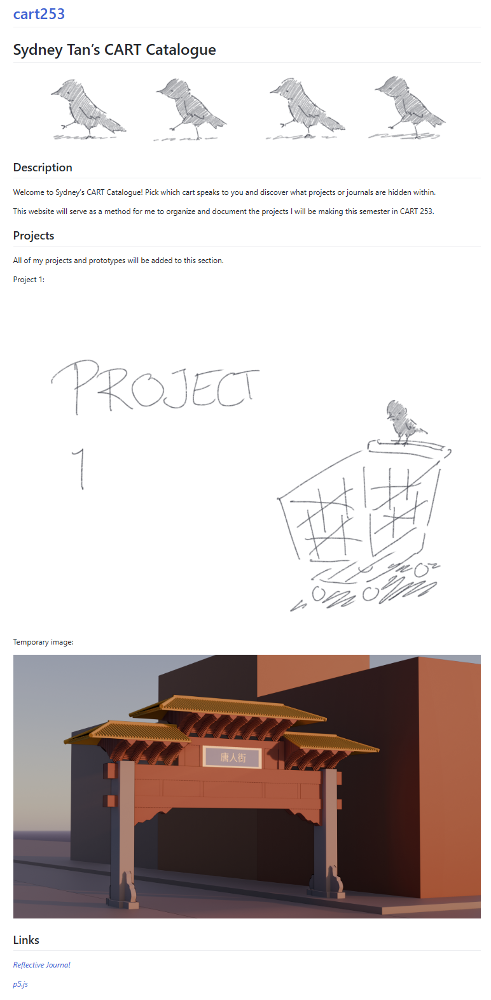

# Reflective Journal

## Entry 1

### Sept 13 2026

This is my first time using both GitHub and Markdown. Honestly, it took a while for me to understand how both worked (mostly the setup and all of the stuff related to which link leads to which page), but the coding part of the website was fairly familiar. I have used p5.js and I've coded 2 really simple games in Unity before so I have a decent understanding of how it works. While making the Markdown website, I had trouble finding the web version of this very journal file online. I keep forgetting how to write the URLs. I want to figure out how to change the layout of the images in the website next. For now, I made a temporary "fix" by extending the image, but for project documentation I'd prefer being able to add text that go around the images. For now, all of them take the entire width of the page which I don't really like. When making a new temporary page for project 1, I forgot to add .md at the end of the file name and that caused a bit of a headache. I do really enjoy how easy it is to work on multiple devices thanks to GitHub. I enjoy working on my own PC at home, so being able to transfer my work from one device to another through another means than Google Drive is quite nice.
My goal is to hopefully be able to work at a video game company. I still don't know what role I'd like to get in that company and I also don't know what type of game I'd like to make so right now I'd like to just experiment a bit. My hope is that throughout these years in this program, I'll be able to get a better idea of what I'd like to make and how I want my audience to feel.

