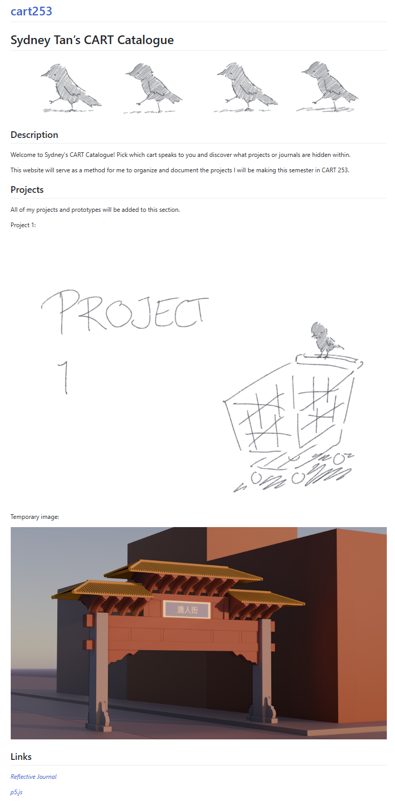
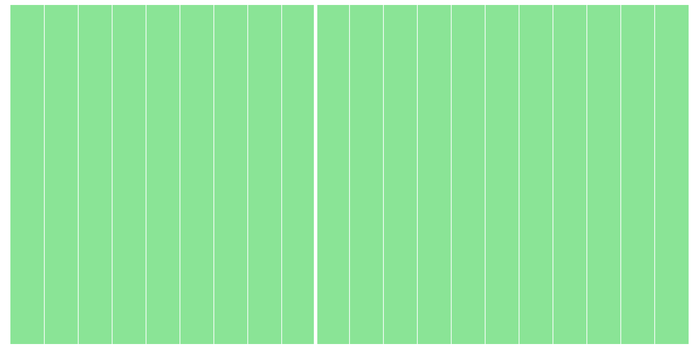

# Reflective Journal

## Entry 1

### Sept 13 2026

This is my first time using both GitHub and Markdown. Honestly, it took a while for me to understand how both worked (mostly the setup and all of the stuff related to which link leads to which page), but the coding part of the website was fairly familiar. I have used p5.js and I've coded 2 really simple games in Unity before so I have a decent understanding of how it works. While making the Markdown website, I had trouble finding the web version of this very journal file online. I keep forgetting how to write the URLs. I want to figure out how to change the layout of the images in the website next. For now, I made a temporary "fix" by extending the image, but for project documentation I'd prefer being able to add text that go around the images. For now, all of them take the entire width of the page which I don't really like. When making a new temporary page for project 1, I forgot to add .md at the end of the file name and that caused a bit of a headache. I do really enjoy how easy it is to work on multiple devices thanks to GitHub. I enjoy working on my own PC at home, so being able to transfer my work from one device to another through another means than Google Drive is quite nice.
My goal is to hopefully be able to work at a video game company. I still don't know what role I'd like to get in that company and I also don't know what type of game I'd like to make so right now I'd like to just experiment a bit. My hope is that throughout these years in this program, I'll be able to get a better idea of what I'd like to make and how I want my audience to feel.

## Entry 2

### Sept 15 2026

During the class challenge, me, Angy and Konstantinos made a sunset lansdcape with a crow that appears when mouse is pressed. We had used p5.js before so for the most part, this challenge was really just a review of what we had learned before. We used a for loop to create a sunset gradient and a bunch of triangles and a quad to make the mountains. The entire bird was made in a single function and is made of circles (body and eyes) triangles (eyebrows and beak), ellipses (the angry circle near the beak), and lines (feet). The bird and a caw mp3 get called when mouse is pressed. As mentioned earlier, the 3 of us already worked on p5.js before so the challenge was mostly a review of things we had done in previous semesters in Dawson IMA. Personally, I never added sounds to my p5 projects so I did learn how to do that today. In some ways it is quite similar to how images are added to the README.md page so it wasn't complicated. The most challenging parts were the GiHub side of things. We had trouble getting the code to preview on the web and we also had trouble opening the project page.

For the most part, the prototyping instructions assignment was more of a review of codes I've used before. The first prototype I made was the one with the frog. Cuz I like frogs. This one's name is Johnny the Frog. It wasn't challenging to make, just time consuming. I don't enjoy making triangles in p5. This one went very well. I didn't come across any troubles while making it. I think it'd be fun if I added a function where the frog opens its mouth and ribbits when the mouse is clicked. The second prototype is the weird shapes thing I've titled Beats because it reminds me of those music visuals that react to sound. Except this one changes depending on mouse movement. I wanted to make something that was a bit more visually appealing for this one. This one was also mostly just a review of codes I've learnt before. The hard part of this prototype was making the file itself. I made this one on a separate day from the frog so I forgot how to start a file. I ended up copy pasting the frog file but that went horribly wrong and there were some issues where my computer was telling me I couldn't delete the misplaced files because I didn't have administrative permissions or something like that. In the end I just redownloaded the template file on Pippin's website and that worked great. The final prototype is a thing with black and white lines that kinda get cut at different points. For this one, I wanted to try a thing in p5.js I'd never used before. I stumbled across shearX and shearY. I wanted to test them out and ended up with this. I did a bit of experimenting with different shapes and parameters before arriving at the current final result. If I were to continue this prototype further, I'd try to include map in it to see if I can make the shear lines move in a smooth manner.

## Entry 3

### Sept 27 2026

Oh boy, this one. Once again, I've used p5.js in Dawson IMA before so I'm familiar with variables. For the challenge, Angy and I were mostly just messing around and trying to make the funniest and weirdest version of the challenge we could do. Both of us were familiar with how to complete the challenge so we divided the work in this manner: i was in charge of drawing the bird on p5.js and making sure all of its parts were connected with variables and angy was in charge of all the mouvements and variations in the variables' values. Overall, it wasn't too challenging but a lot of fun to make. 

The homework also wasn't too hard. I didn't come across any problems I couldn't fix. Once again, it was mostly just me revisiting things I've learnt before. But man did the 3rd one take a lot of time. The first one is really realy simple. Just a bunch of leaves who's rgb values change when the mouse moves. I was going to add more leaves but I didn't wanna deal with rotate or have to manually change all of the leaf orientations so I stopped it there. The 2nd one I've made a similar [project on p5.js back in Dawson](https://editor.p5js.org/tinglt/sketches/UUkKMK2hf). It was an in class assignment. I wanted to make something similar but on a larger scale. So I made bubbles that floated up at different speeds. There's also a timer so that a few bubbles can spawn in a bit later than the initial few. There are 6 different bubbles that have different values. Their initial colours and positions are randomized. Some of them change colour as they go up as well. Their alphas also decrease as they go up. I tried turning the bg off for this project, the result is pretty cool too. I should've probably changed the canvas format to be shorter but wider too. Finally, the 3rd one. This one wasn't exactly challenging in terms of skill but it was definitely challenging mentally. The problems I came across where easy to fix but there were so many variables with different names that took so long to write I was about to lose my mind. There were a bunch of times where something didn't work how I wanted it to and then it suddenly hit me why that was the case. A kind of "of course that wouldn't work" moment. I do like how it turned out though. Now that I finished it and have time to think of how to improve it, I think it'd be fun to make it so that the last lines change the line colours. But that'd be so much work and I'm pretty tired so I won't do that.

