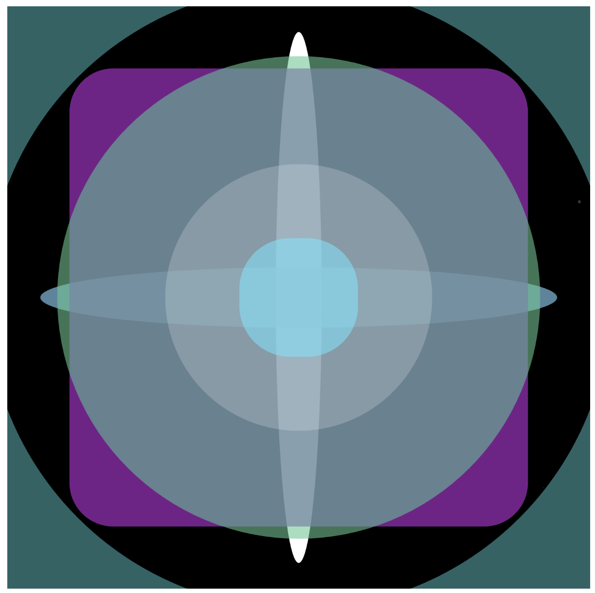
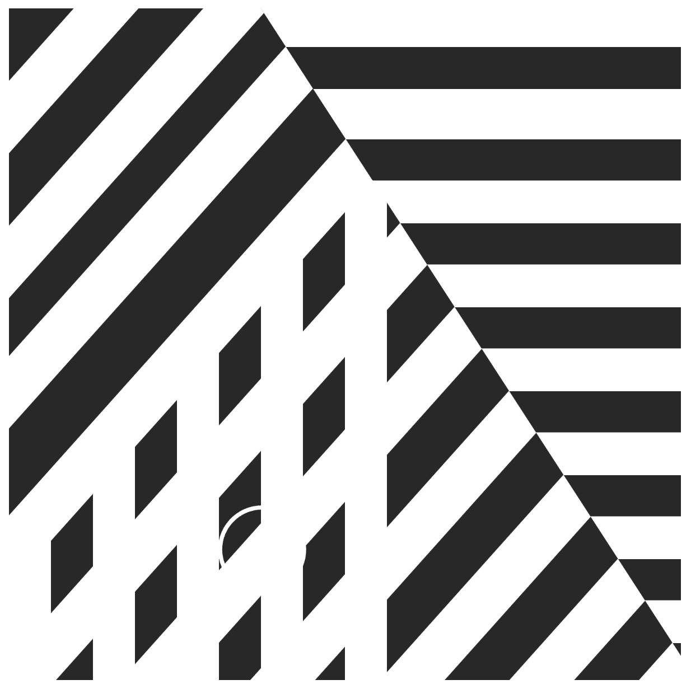
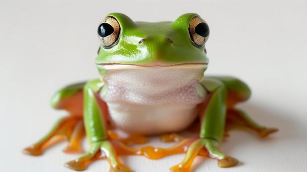

# Prototyping: Instructions

Sydney Tan

[View this project online](https://sydneylttan-dot.github.io/cart253/prototypes/)

## Description

Assignment 2 of CART 253. Here are my 3 prototypes for the instructions prototype assignment.

PROTOTYPE 1: Johnny the Frog: 

PROTOTYPE 2: Beats: 

PROTOTYPE 3: Crossroads: 

[Reflective Journal: Entry #2](https://sydneylttan-dot.github.io/cart253/journal#entry-2)

## Attribution

> - This project uses [p5.js](https://p5js.org).
> - The p5.js frog (Prototype 1) was based off of this reference picture found on photoAC:

## License

> This project is licensed under a Creative Commons Attribution ([CC BY 4.0](https://creativecommons.org/licenses/by/4.0/deed.en)) license with the exception of libraries and other components with their own licenses.