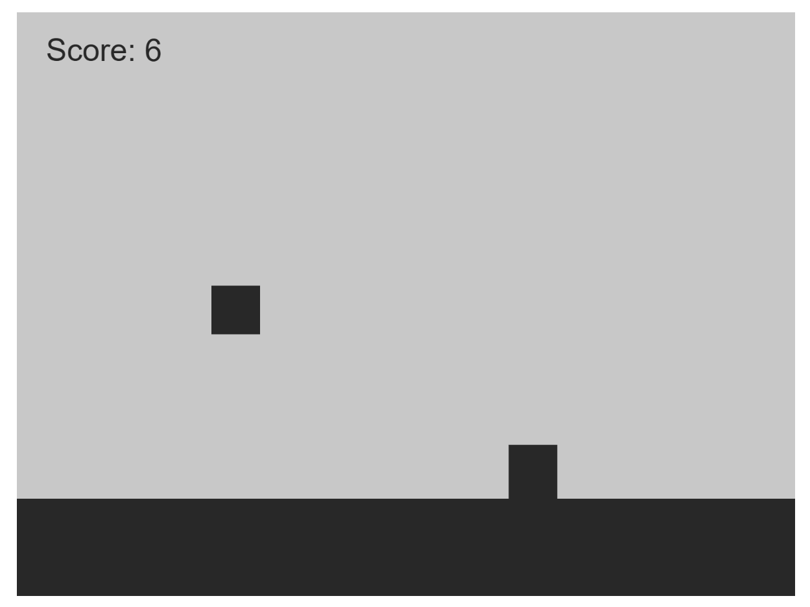
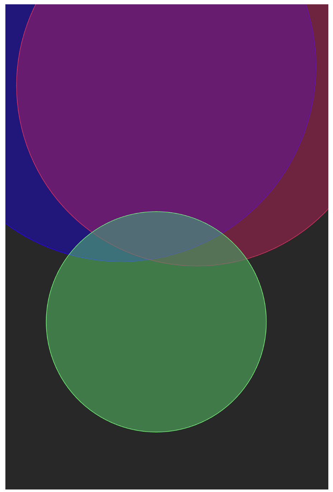
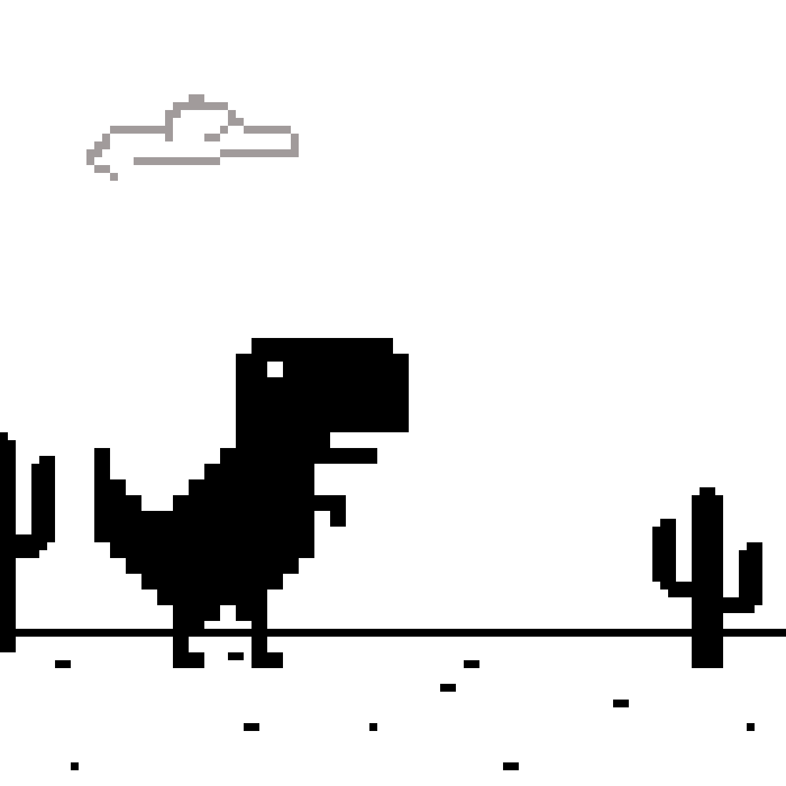
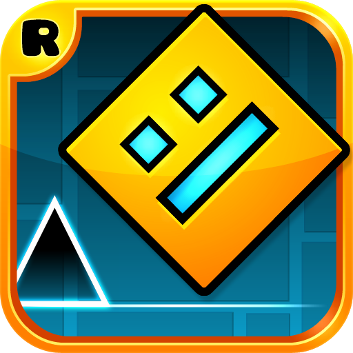

# Prototyping: Conditionals

Sydney Tan

[View this project online](https://sydneylttan-dot.github.io/cart253/prototypes/prototyping-conditionals/)

## Description

Assignment 4 of CART 253. Here are my 3 prototypes for the prototyping conditionals assignment.

PROTOTYPE 1: The Wifi Works and Yet I Still Want to Play: 

PROTOTYPE 2: Colour Mixing: 

PROTOTYPE 3: Harp of Colours: 

[Reflective Journal: Entry #3](https://sydneylttan-dot.github.io/cart253/journal#entry-3)

## Attribution

> - This project uses [p5.js](https://p5js.org).
> - The Wifi Works and Yet I Still Want to Play was inspired by the no wifi Dinosaur Game and Geometry Dash

## License

> This project is licensed under a Creative Commons Attribution ([CC BY 4.0](https://creativecommons.org/licenses/by/4.0/deed.en)) license with the exception of libraries and other components with their own licenses.