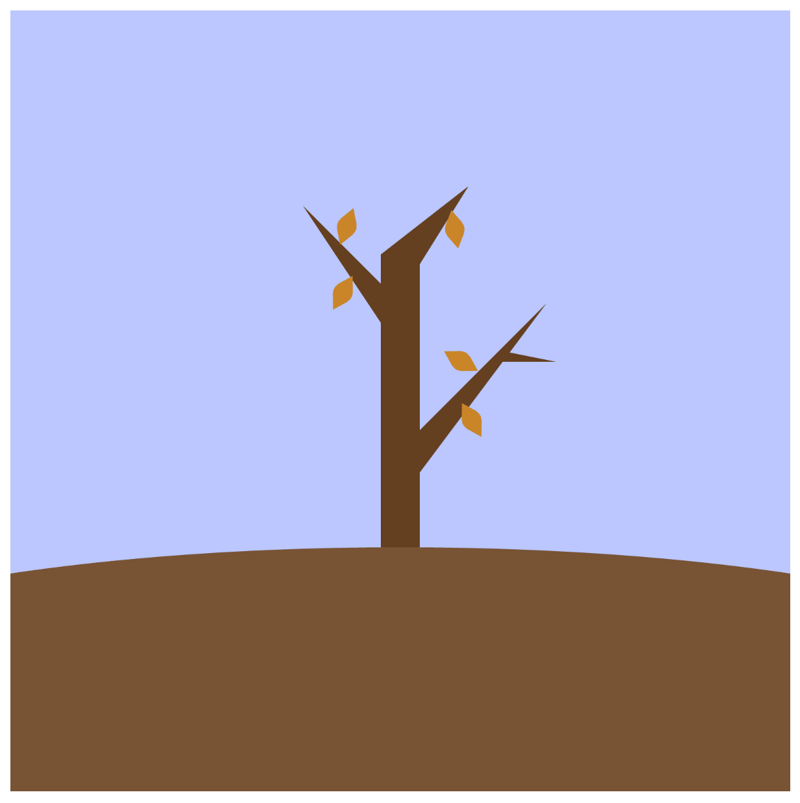
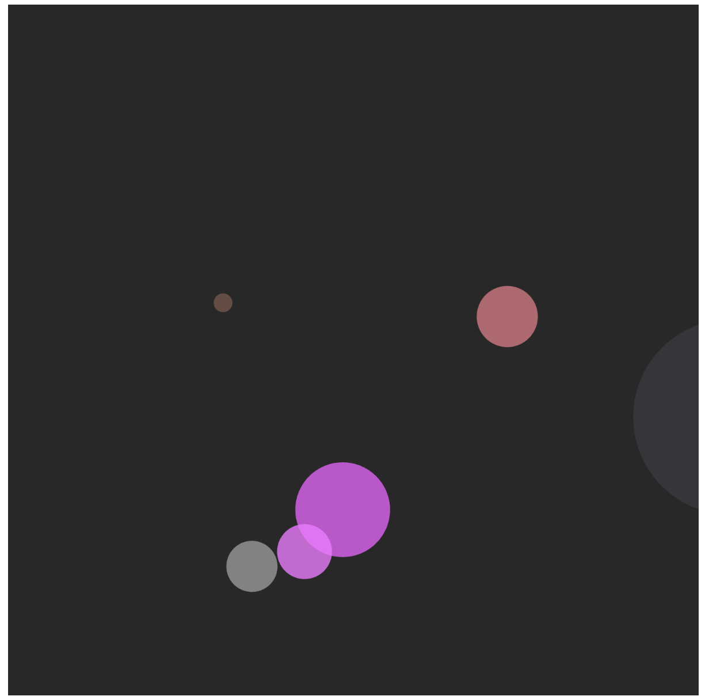

# Prototyping: Variables

Sydney Tan

[View this project online](https://sydneylttan-dot.github.io/cart253/prototypes/prototyping-variables/)

## Description

Assignment 3 of CART 253. Here are my 3 prototypes for the prototyping variables assignment.

PROTOTYPE 1: The Passing of Seasons: 

PROTOTYPE 2: Bubbles: 

PROTOTYPE 3: Harp of Colours: 

[Reflective Journal: Entry #3](https://sydneylttan-dot.github.io/cart253/journal#entry-3)

## Attribution

> - This project uses [p5.js](https://p5js.org).
> - The Bubbles project was inspired by a [p5.js in class assignment I did back in Dawson IMA](https://editor.p5js.org/tinglt/sketches/UUkKMK2hf)

## License

> This project is licensed under a Creative Commons Attribution ([CC BY 4.0](https://creativecommons.org/licenses/by/4.0/deed.en)) license with the exception of libraries and other components with their own licenses.